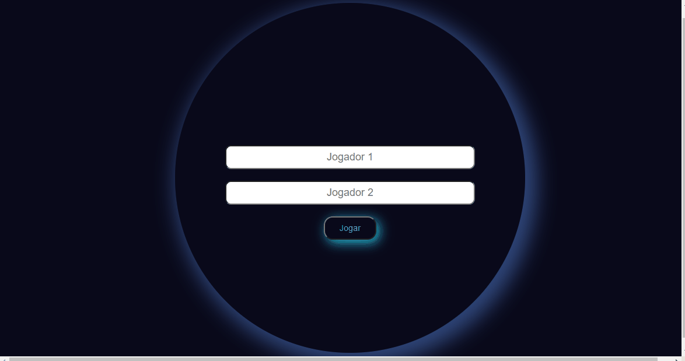
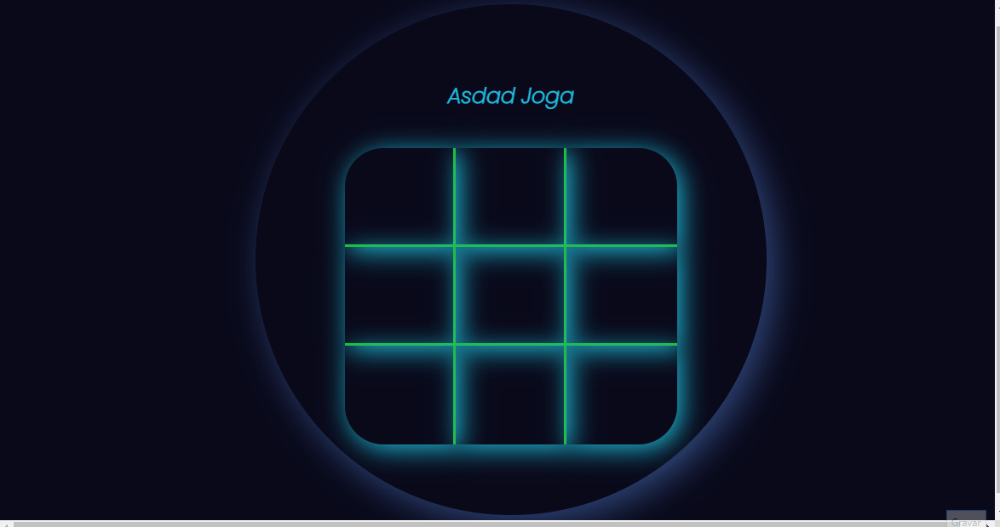
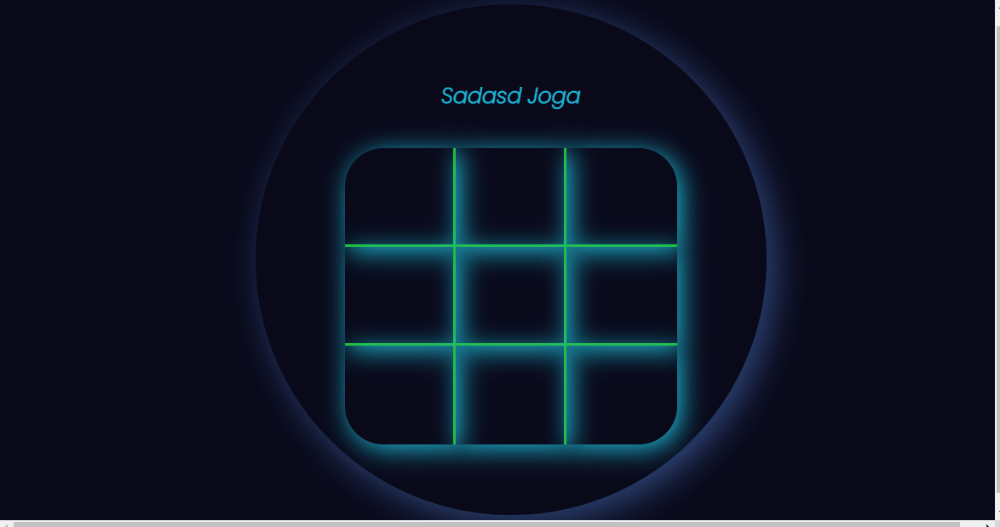

# Jogo da Velha Feito com HTML5, CSS3 e JavaScript puro 

Um mini projeto de iniciativa própria para treinamento dos conhecimentos com HTml, Css e JavaScript puro sem frameworks ou bibliotecas externas acabei criando um Jogo da velha bem bacana e divertido 

### Vamos as telas de Game 

#### Tela de Login com autenticação de Campos vazios

#### Tela de Jogo com vencedor 

#### Tela de Empate 

Design Totalmente criado por mim, com efeitos de sombras, lógica toda em JavaScript, 

Integração com Html JavaScript, Css pela Dom pura, Estilo puro Css3

## Estruturas

- ***HTML5***
- ***CSS3***
- ***JavaScript/ Dom*** 

Um projeto que achei bem bacana e bem elaborado, um desafio e tanto sem ajuda, usando a cabeça, e me desafiando cada vez mais, cheguei ao resultado acima, que na minha percepção é mias que satisfatório

***dev: Henrique Silva dos Santos***

***Desenvolvedor Web***
