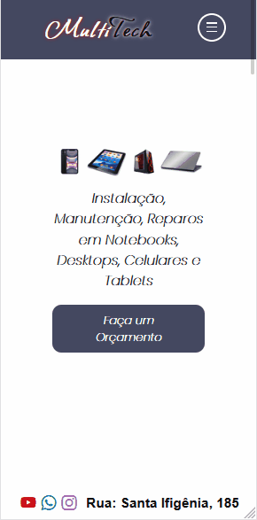

# Projeto Multitech

  O Projeto ***Multitech*** veio de uma antiga Micro-Empresa que eu tinha de Manutenção e Reparos em Celulares, Tablets, Desktop, Notebooks, a partir daí uni a ideia da empresa com a oportunidade de treinamento com Front-End  criei esse mini-projeto de autoria total minha.

### Um Pouco sobre a Landing Page Multitech

Veja os ***Gif's*** que criei para demonstração dos Design da Landing Page totalmente Responsivos

#### Landing Page no Mobile

#### Landing Page no Desktop

## Linguagens e Frameworks do Projeto

- ###           Html5

- ###           Css3

- ###           Bootstrap

- ###           Sass & Scss

- ###           JavaScript

#### Obs:

Pelo projeto ter pouca integração com código *JavaScript** para efeitos optei pelo uso de ***JavaScript*** puro e não em ***Jquery** no efeito ***Paralax***  do Responsivo Mobile que abre o menu de Navegação 

Ícones somente das redes sociais ***Whatsapp, Instagram, Youtube***

- ### Logo da ***MultiTech*** Feito nos Css mesmo

- ### Desenho do Hambúrguer Toogle no Mobile Feito também no Css  

Código criado com pensamento na  Lógica , SEO, Organização, Comentários, Tudo visando um melhor entendimento do mesmo 

##### ***Nome: Henrique Silva dos Santos***

##### ***Desenvolvedor Web.***

